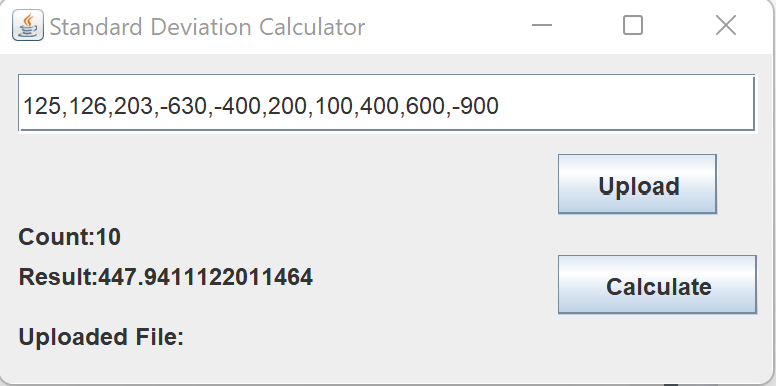
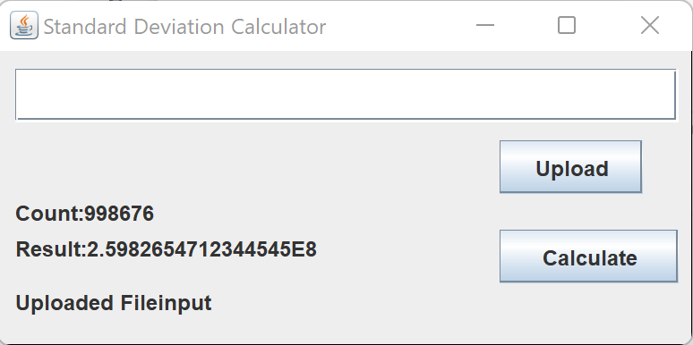

# SOEN 6011 - Software Engineering Project - Eternity

This project is to develop a calculator application to calculate standard deviation function. 

## Pre Requisites

Install Java 8 or above.

## Releases
Build : 1.0.1

Recent Bug Fizes:
  - Resolve division by zero error.

## Compile 

1. IDE
   - Import Project into IDE.
   - Build the project
 
2. Command Line
   - Go to SOEN6011-Eternity directory
   - Type the following command
     ```java
	     javac -d "classes" src/app/App.java src/app/AppFrame.java src/math/Statistics.java
     ```

## Run the Application

1. Double click the Calculator-1.0.1.jar

2. Command line - Running Jar file

   ```java
     java -jar Calculator-1.0.1.jar
   ```
Note: Calculator-1.0.1.jar located in the target folder.

3. IDE
   - Run the project from IDE by selecting App.java as main application.

4. Command Line - Running App.java
   - After the compilation is successfull though command line. Run the following command.
     ```java
	     java -classpath "classes" app.App
	 ```

## Application working

1. Enter numbers in comma separated format in the textfield and click calculate.
   

2. Upload a file with numbers where each number is on a separate line and click calculate.
   

Note: The input is text field is given preference over the file input. Keep the textfield blank while using File as input.